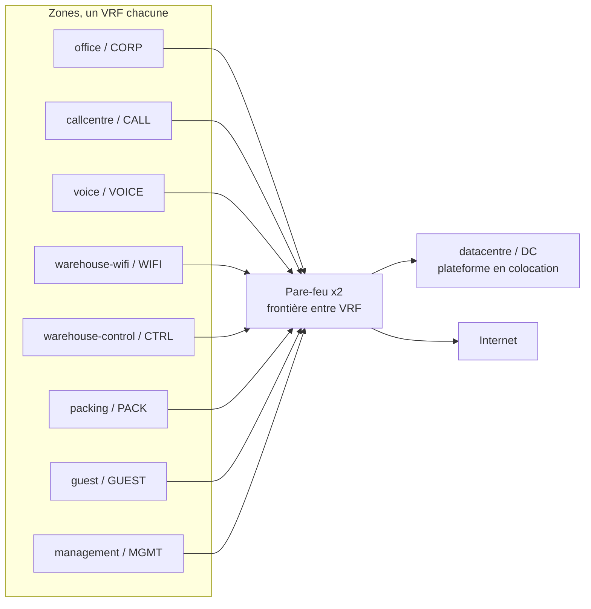

# Vue logique — décision B (B4 + B2)

```mermaid
graph LR
  FW["Pare-feu x2<br/>frontière entre VRF"]
  subgraph Zones["Zones, un VRF chacune"]
    O["office / CORP"]
    C["callcentre / CALL"]
    V["voice / VOICE"]
    WF["warehouse-wifi / WIFI"]
    WC["warehouse-control / CTRL"]
    P["packing / PACK"]
    G["guest / GUEST"]
    M["management / MGMT"]
  end
  DC["datacentre / DC<br/>plateforme en colocation"]
  I["Internet"]
  O --> FW
  C --> FW
  V --> FW
  WF --> FW
  WC --> FW
  P --> FW
  G --> FW
  M --> FW
  FW --> DC
  FW --> I
```

Le routage inter-VRF passe uniquement par le pare-feu.
Les paiements par carte sont déportés (B4) : le centre d'appels sort du périmètre PCI DSS.