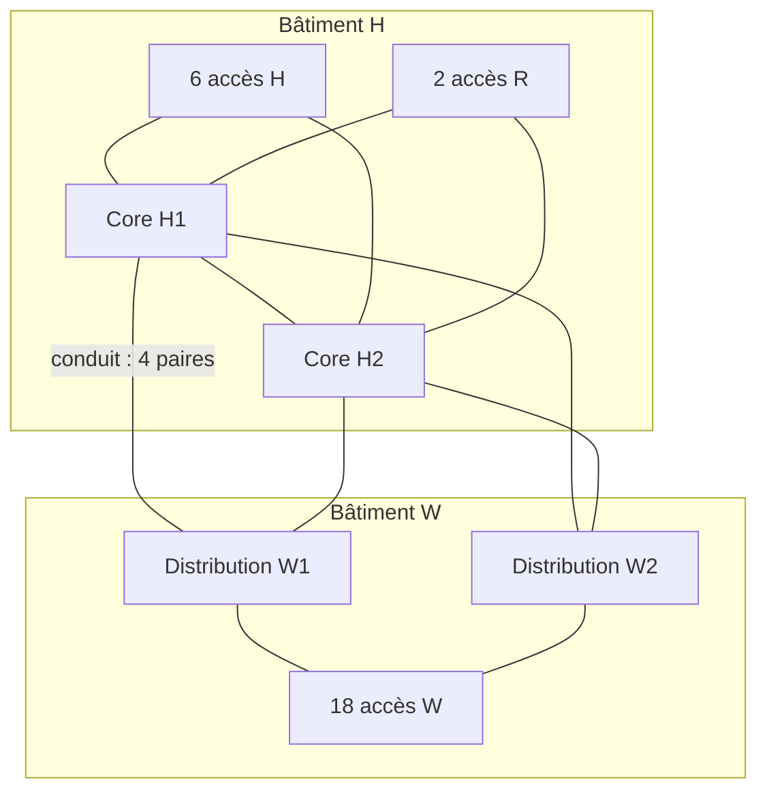

# Vue physique — décision A3

```mermaid
graph TD
  subgraph H["Bâtiment H"]
    CH1["Core H1"]
    CH2["Core H2"]
    AH["6 accès H"]
    AR["2 accès R"]
  end
  subgraph W["Bâtiment W"]
    DW1["Distribution W1"]
    DW2["Distribution W2"]
    AW["18 accès W"]
  end
  CH1 --- CH2
  AH --- CH1
  AH --- CH2
  AR --- CH1
  AR --- CH2
  CH1 ---|"conduit : 4 paires"| DW1
  CH1 --- DW2
  CH2 --- DW1
  CH2 --- DW2
  DW1 --- AW
  DW2 --- AW
```

Conduit : 12 paires au total, 4 prises par la GTB, **4 utilisées par A3**, 4 libres.
A1 en demanderait 36 et A2 environ 27, ce qui dépasse les 8 paires disponibles.